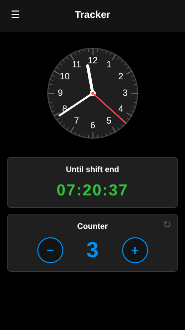
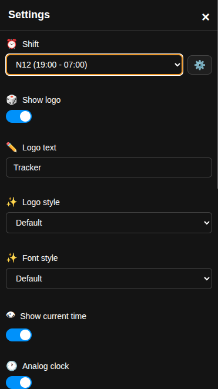
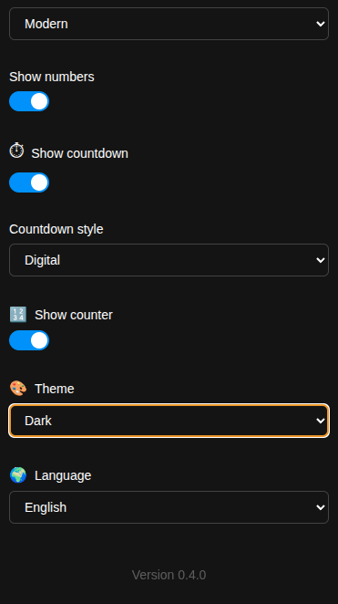
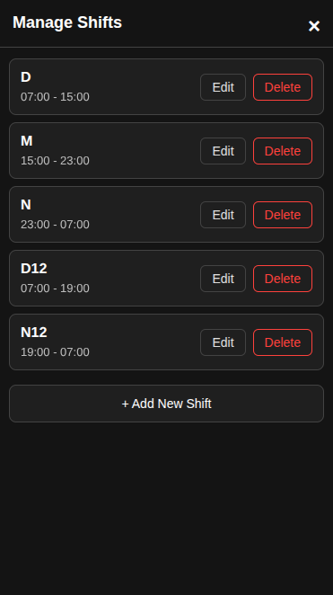

# Shift Tracker

A Progressive Web App (PWA) for tracking work shifts with real-time countdown timers, customizable clocks, and counters.


| | | | |
|:---:|:---:|:---:|:---:|
|  |  |  |  |


## Features

### ⏰ Shift Management
- **Customizable Shifts**: Create, edit, and delete work shifts with custom names and time ranges
- **Multiple Shift Types**: Support for 8-hour, 12-hour, and night shifts (midnight wrap)
- **Auto-Selection**: Automatically switches to the first available shift when the current one is deleted
- **LocalStorage Persistence**: All shifts are saved locally and persist across browser sessions

### 🕐 Clock Display
- **Analog & Digital Clocks**: Toggle between analog and digital time displays
- **Multiple Clock Styles**: Modern, Classic, Neon, Cyberpunk, Sunset, Frosted, and Cozy themes
- **Digital Clock Variations**: Default, LCD, Neon, Segment, Flip, and Minimal styles
- **Hide/Show Options**: Choose whether to display the current time

### ⏳ Countdown Timer
- **Real-Time Countdown**: Shows time remaining until shift end
- **Multiple Display Styles**: Digital, Cards, Text, Circular, Flip, Cyber, and Cozy formats
- **Status Messages**: Displays "Shift has not started yet" or "Shift has ended" when appropriate
- **Dynamic Updates**: Updates every second without animation glitches

### 🔢 Counter
- **Manual Counter**: Track items, tasks, or anything else during your shift
- **Default Values**: Automatically sets to 8 or 12 based on shift type
- **Increment/Decrement**: Easy +/- buttons
- **Reset Function**: Quick reset to default value
- **Persistent State**: Counter value saved across sessions

### 🎨 Customization
- **Theme Modes**: Dark, Light, and Custom themes
- **Custom Colors**: Set background colors for header, clock, countdown, and counter sections
- **Logo Customization**: Change logo text and choose from 12 style options (Default, Neon, Bold, Rainbow, Elegant, Retro, Glitch, Gradient, Fire, Cyberpunk, Frosted, Minimal)
- **Font Styles**: Apply 12 different font styles to countdown and counter text
- **Hide/Show Components**: Toggle visibility of logo, clock, countdown, and counter

### 🌍 Multi-Language Support
- **3 Languages**: English (en), Czech (cs), and Ukrainian (uk)
- **Fully Translated UI**: All interface elements, messages, and errors are localized
- **Dynamic Language Switching**: Change language without page reload

### 📱 Progressive Web App
- **Installable**: Install on mobile devices and desktops
- **Offline Support**: Works without internet connection via service worker
- **Responsive Design**: Adapts to all screen sizes
- **Portrait Optimized**: Best experience in portrait orientation

## Quick Start

1. Open `index.full.html` in your browser (for development)
2. Or open `index.html` (minified production version)
3. Click the settings icon (☰) to configure your shifts and preferences
4. Select your shift from the dropdown
5. Watch the countdown timer until your shift ends!

## Managing Shifts

1. Open **Settings** → Find the **Shift** dropdown
2. Click the **⚙️ button** next to the shift selector
3. In the **Manage Shifts** drawer:
   - **Add**: Click "+ Add New Shift" to create a new shift
   - **Edit**: Click "Edit" on any shift to modify it
   - **Delete**: Click "Delete" to remove a shift (with confirmation)
4. All changes are automatically saved to localStorage

### Shift Properties
- **Name**: 1-10 characters (e.g., "D", "M", "N", "Morning", "Evening")
- **Start Time**: HH:MM format (00:00 - 23:59)
- **End Time**: HH:MM format (supports midnight wrap for night shifts)

## File Structure

```
countdown/
├── index.full.html      # Development version (full, unminified)
├── index.html           # Production version (minified)
├── manifest.json        # PWA manifest
├── service-worker.js    # Service worker for offline support
├── icons/               # App icons
│   ├── favicon.svg      # Alarm clock icon (SVG)
│   ├── favicon.ico      # Browser favicon
│   ├── apple-touch-icon.png  # iOS icon (180x180)
│   ├── icon-192.png     # Android icon (192x192)
│   └── icon-512.png     # Android icon (512x512)
└── README.md
```

## Technologies Used

- **HTML5**: Semantic markup, time inputs, canvas for analog clock
- **CSS3**: Flexbox, animations, gradients, custom properties
- **Vanilla JavaScript**: No frameworks, pure ES6+
- **LocalStorage API**: Client-side data persistence
- **Service Worker**: Offline functionality
- **SVG**: Scalable graphics for analog clock and icons

## Browser Support

- Chrome/Edge 90+
- Firefox 88+
- Safari 14+
- Mobile browsers (iOS Safari, Chrome Mobile)

## Version

**v0.4.0** - Added customizable shift management

## License

Personal project - feel free to use and modify as needed.
